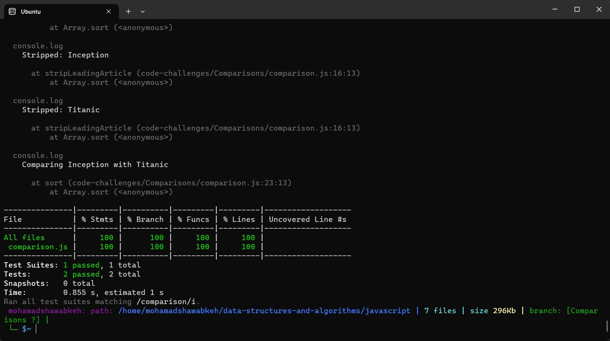

# Movie Sorting Challenge

This repository contains code that addresses a code challenge involving sorting movies using different criteria. The challenge includes two sorting functions: one that sorts movies by the most recent year and another that sorts movies alphabetically by title while ignoring leading articles.

## Movie Class

The `Movie` class is defined in the `comparison.js` file. It has three properties: `title`, `year`, and `genres`. This class represents the movie objects that will be sorted using the provided sorting functions.

## Sorting Functions

Two sorting functions are provided in the `comparison.js` file:

1. `sortByYear(movies)`: This function sorts movies by their most recent year first.
2. `sortByTitle(movies)`: This function sorts movies alphabetically by title, ignoring leading articles ("A," "An," "The").

## Running Tests

Tests for the sorting functions are defined in the `comparison.test.js` file using the Jest testing framework. To run the tests, follow these steps:

1. Make sure you have Node.js and npm (Node Package Manager) installed on your system.
2. Install the project dependencies by running `npm install` in your terminal.
3. Run the tests using the command `npm test` in your terminal.

The test results will be displayed in the terminal, indicating whether the sorting functions are working as expected.

## Debugging

If you encounter any issues while running the tests, there are debugging steps you can follow:

1. Check the paths in your `require` statements to ensure they are correctly pointing to the module files.
2. Verify that the data in your test cases matches the expected outcomes.
3. Add `console.log` statements in your sorting functions and test cases to see intermediate values and comparisons during sorting.

By following these steps, you can identify any issues with the code, data, or expected outcomes that might be causing test failures.

### Run test
  - to run test: npm run test comparison
  