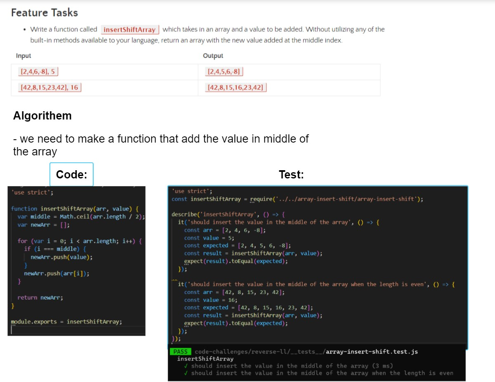

## Array-insert-shift

#### Summary, Description, Approach & Efficiency, Solution

- i am having an array and i want add a value in the middle of it 

- in this code provided I detected the middleIndex from Math.floor, them push it in defined empty array inside an If condition, after this we push the other index. solution provided in the array-insert-shift.js

- actual inputs can be any components example: [2, 4, 6, -8],5 

- and the outputs will be :[2, 4,5, 6, -8]

test can be found at [array-insert-shift.test.js]
