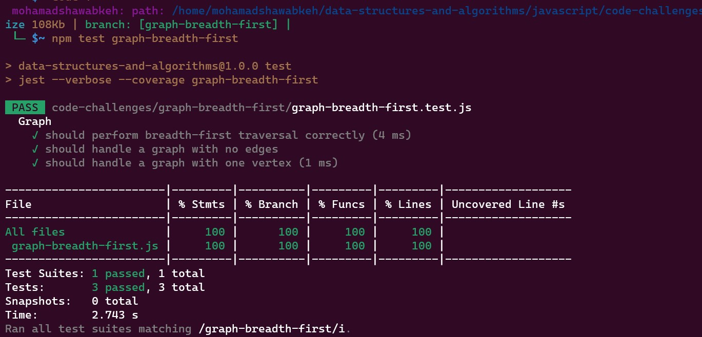

# Graph Breadth-First Traversal

This repository contains an implementation of a graph data structure with a breadth-first traversal method in JavaScript. The graph allows you to add vertices, create edges between them, and perform a breadth-first traversal to visit nodes in a specific order.

## WhiteBoard

.jpg)

## Test

