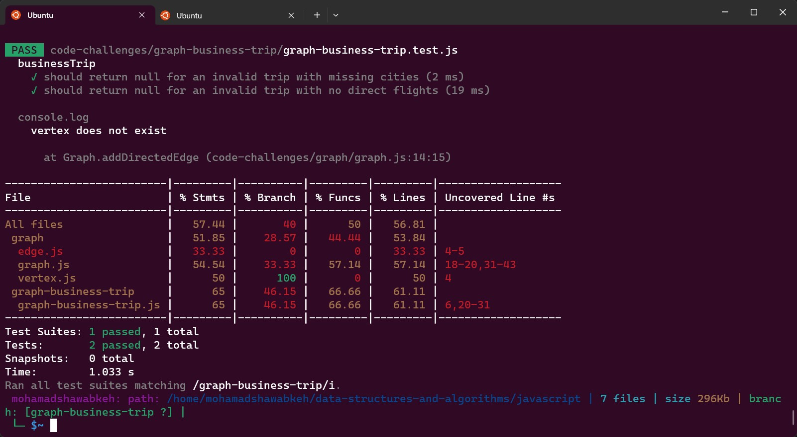

# Code Challenge: Class 37

## WhiteBoard
.jpg)

## Feature Tasks
Write a function called business trip
Arguments: graph, array of city names
Return: the cost of the trip (if it’s possible) or null (if not)
Determine whether the trip is possible with direct flights, and how much it would cost.

## Test

