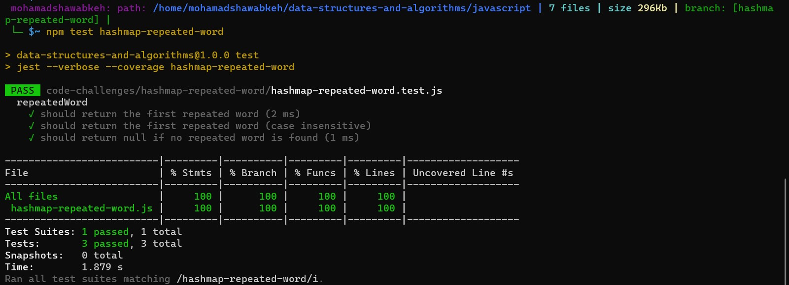

# Hashmap Repeated Word

## Whiteboard 
.jpg)

## Usage 

```Javascript
const input = "Once upon a time, there was a brave princess who...";
const result = repeatedWord(input);
console.log(result); // Output: "a"
```

### Photo for test in terminal


