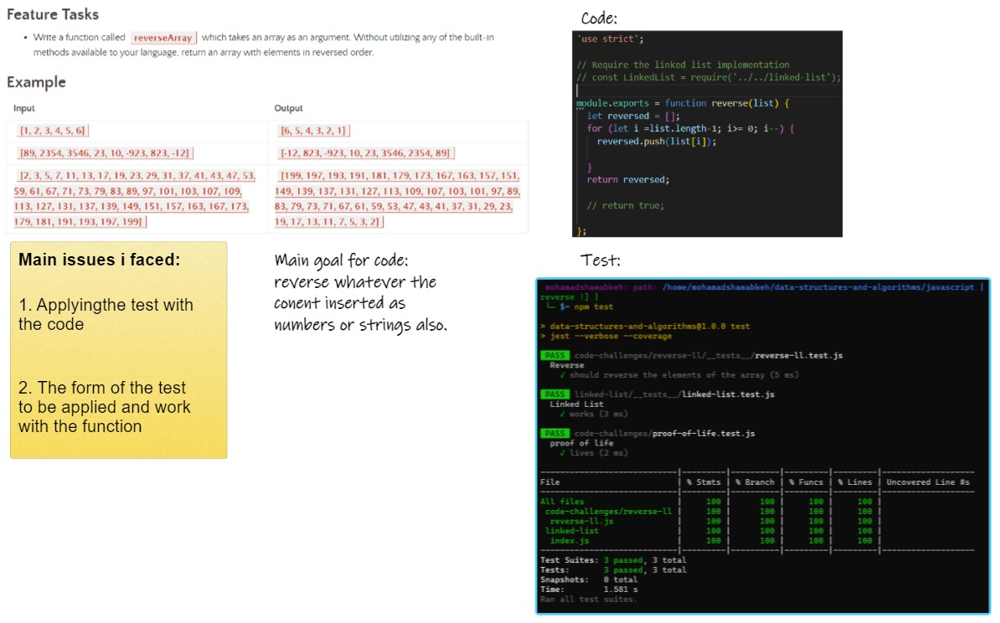

# Table of Contents

## Reverse Array

#### Summary, Description, Approach & Efficiency, Solution
- i am having an array and i want to reverse its content

- in this code provided that we can reverse an array, whatever the components for this array. solution provided in the reverse-II.js

- actual inputs can be any components example: [1,8,"sting",-48]

- and the outputs will be :[-48,"sting",8,1]
