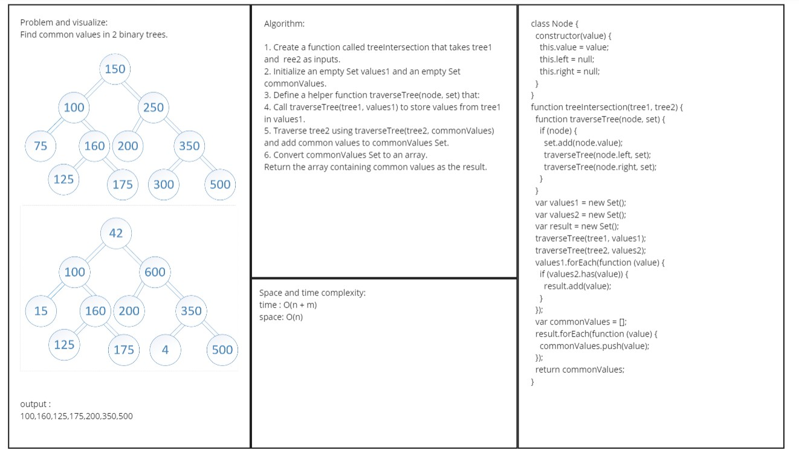
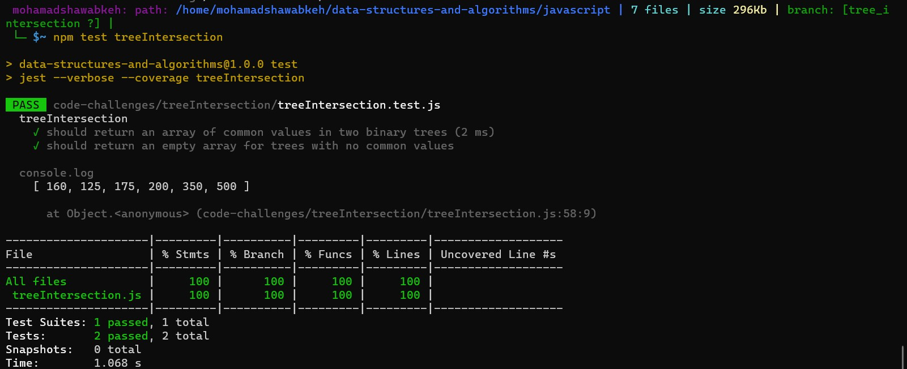

# Code Challenge
Find common values in 2 binary trees.

## Whiteboard 

## Specifications
- Read all of the following instructions carefully. Name things exactly as described.
- Do all your work in a public repository (matching the example provided by your instructor) called data-structures-and-algorithms, with - a well-formatted, detailed top-level README.md
- Create a branch in your repository called tree-intersection On your branch, create…
- JavaScript: a folder named treeIntersection which contains a file called tree-intersection.js

## Feature Tasks
- Write a function called tree_intersection that takes two binary trees as parameters.
- Using your Hashmap implementation as a part of your algorithm, return a set of values found in both trees.

## Structure and Testing
- Utilize the Single-responsibility principle: any methods you write should be clean, reusable, abstract component parts to the whole challenge. You will be given feedback and marked down if you attempt to define a large, complex algorithm in one function definition.

- Write at least three test assertions for each method that you define.

- Ensure your tests are passing before you submit your solution.
